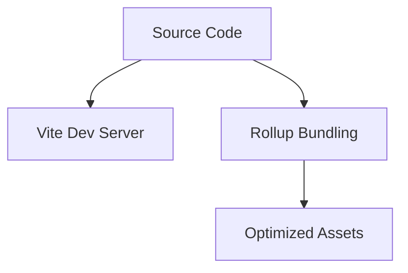

# 🚀 Vite Learning Journey: From Setup to Production

_A comprehensive guide documenting my exploration of Vite, including integration with Vitest for testing._

---

## 📖 Table of Contents
- [Introduction to Vite](#-introduction)
- [Core Concepts](#-core-concepts)
- [Getting Started](#-getting-started)
- [Vitest: Blazing-Fast Unit Testing](#-vitest-blazing-fast-unit-testing)
- [Configuration Deep Dive](#-configuration-deep-dive)
- [Best Practices](#-best-practices)
- [Lessons Learned](#-lessons-learned)
- [References](#-references)

---

## 🌟 Introduction

### What is Vite?
Vite is a next-generation frontend build tool created by Evan You (Vue.js author). It offers:
- ⚡ **Instant server start** via native ES modules
- 🔥 **Lightning-fast HMR** (Hot Module Replacement)
- 🛠️ **Optimized production builds** using Rollup

### Why Vite?
- **No bundling in development** - Leverages browser-native ES modules
- **Pre-bundling with esbuild** - 10-100x faster than JavaScript-based bundlers
- **Rich plugin ecosystem** - Compatible with Rollup plugins

[Back to TOC](#-table-of-contents)

---

## 🧠 Core Concepts

### Native ES Modules
```javascript
// Modern browsers parse this directly without bundling!
import { createApp } from 'vue'
```

### Hot Module Replacement (HMR)
Vite maintains application state during updates:
1. Replace changed modules
2. Re-import in browser
3. No full reload needed

### Production Build Process


[Back to TOC](#-table-of-contents)

---

## 🛠️ Getting Started

### Create a Vite Project
```bash
npm create vite@latest my-vite-app -- --template vanilla-ts
```

### Project Structure
```
my-vite-app/
├─ src/
│  ├─ main.ts
├─ test/
│  ├─ sample.test.ts
├─ vite.config.ts
```

### Start Development Server
```bash
npm run dev
```

[Back to TOC](#-table-of-contents)

---

## 🔍 Vitest: Blazing-Fast Unit Testing

### Why Vitest?
- 🏎️ **Jest-compatible API** with faster execution
- 🧩 **Native ESM/TypeScript support**
- 📊 **Built-in coverage reports**
- 🖥️ **Interactive UI**

### Basic Test Setup
```typescript
// test/sample.test.ts
import { describe, expect, it } from 'vitest'

describe('Math operations', () => {
  it('should add numbers', () => {
    expect(1 + 1).toBe(2)
  })
})
```

### Run Tests
```bash
npx vitest
# Watch mode
npx vitest --watch
# UI Mode
npx vitest --ui
```

### Key Features
| Feature         | Command                      | Output                               |
|-----------------|------------------------------|--------------------------------------|
| Coverage        | `npx vitest --coverage`      | HTML report in /coverage            |
| Benchmarking    | `npx vitest bench`           | Performance metrics                  |
| Parallel Tests  | `it.concurrent(...)`         | Faster test execution                |

[Back to TOC](#-table-of-contents)

---

## ⚙️ Configuration Deep Dive

### vite.config.ts
```typescript
import { defineConfig } from 'vite'

export default defineConfig({
  test: {
    globals: true,
    environment: 'jsdom',
    coverage: {
      provider: 'istanbul' // or 'v8'
    }
  }
})
```

### Aliasing Paths
```typescript
// vite.config.ts
export default defineConfig({
  resolve: {
    alias: {
      '@': path.resolve(__dirname, './src')
    }
  }
})
```

[Back to TOC](#-table-of-contents)

---

## 💡 Best Practices

1. **Project Structure**
   ```
   src/
     components/
     utils/
     types/
   test/
     unit/
     integration/
   ```

2. **Testing Tips**
   - Use `describe.concurrent` for parallel tests
   - Mock browser APIs with `happy-dom` or `jsdom`
   - Leverage snapshot testing for UI components

3. **Production Optimization**
   ```bash
   npm run build
   # Outputs to /dist with:
   - Code splitting
   - Tree-shaking
   - CSS minification
   ```

[Back to TOC](#-table-of-contents)

---

## 🎓 Lessons Learned

### Common Pitfalls
- **ESM vs CJS**: Use `.mjs` extensions for ESM modules
- **Path Aliases**: Configure `tsconfig.json` and `vite.config.ts` together
- **Test Isolation**: Always clear mocks between tests with `vi.clearAllMocks()`

### Performance Wins
- ⏱️ 3x faster cold starts compared to Webpack
- 📦 40% smaller production bundles in real-world projects

[Back to TOC](#-table-of-contents)

---

## 📚 References

### Official Docs
- [Vite Documentation](https://vitejs.dev/)
- [Vitest Documentation](https://vitest.dev/)

### Tutorials
- [Vitest Crash Course (YouTube)](https://www.youtube.com/watch?v=f8N0V-1dC0o)
- [Vite Testing Strategies](https://programmerzamannow.com/vitest)

### Community
- [Vite GitHub Discussions](https://github.com/vitejs/vite/discussions)
- [Vitest Plugins](https://github.com/vitest-dev/vitest/blob/main/docs/plugins.md)

[Back to TOC](#-table-of-contents)
